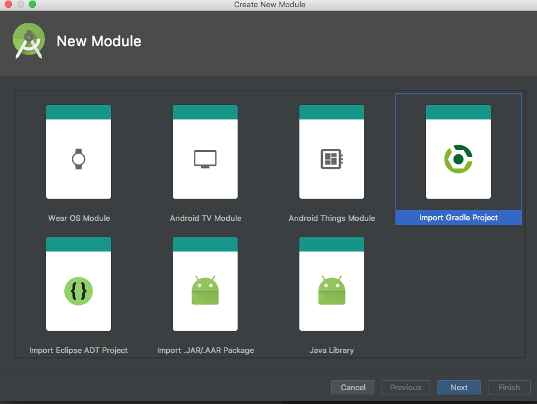
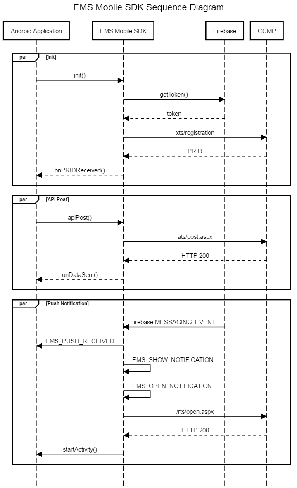

##
# Intended Audience

This document, source code, and resulting compiled library (SDK) is intended to be used in conjunction with Marketing Suite.  Use of the SDK is only supported after approval from Marketing Suite Client Developer Relations, and your account manager.

# Integrating CCMP with the Android Mobile SDK

CCMP enables marketers to target mobile devices running native applications for iOS and Android. The Android platform uses Firebase, the successor to Google Cloud Messaging (GCM). With push notifications, there are three parties in play: CCMP, Firebase, and the user's device with an app installed. The basic flow is as follows for Push Notifications.


1. After the app starts, the app contacts Firebase and requests a **device token**.
1. The **device token** is sent back to the device.
1. The **device token** is sent to CCMP along with an **App ID** and **Customer ID**.
1. CCMP registers the device token with the **App ID** and **Customer ID**, and sends back a **Push Registration ID** (PRID).
1. CCMP will then launch campaigns intending to target devices that have been registered with Push Notifications through Firebase.
1. Firebase pushes out the notifications to the devices.
1. After the user taps on the notification on the device, the app will notify CCMP that the app was opened from a Notification.

To make all this work, associations need to be set up between all three parties. This guide will walk you through these steps.


## Table of Contents

* Create or open a new project in Android Studio
* Create a Project on Firebase
* Register an App on Firebase
* Integrate the SDK with an App
* Adding the App to CCMP
* EMSMobileSDK Methods and Properties
* Sequence Diagram

### Create or open a new project in Android Studio

1. If you have an existing project you intend to use for Push Notification, open this project, Otherwise [create a new project in Android Studio](https://developer.android.com/studio/projects/create-project.html).

1. Once the project is opened, open the project App level Gradle Script. Copy the value next to **applicationID** in the script, which in the case below is "experian.mycoolapp".


This Application ID is needed to register a new app with Firebase.

1. Also, insure that the Google Repositories are installed. From the **Tools** menu, select **Android** -> **SDK Manager**. Select the **SDK Tools** tab, then expand **Support Repository**. Check **Google Repository** and click **OK**.


### Create a Project on Firebase

A Firebase project is a collection of apps that can use a variety of Google API's including push notifications. If you do not already have a Firebase project you intend to use with push notifications, you'll need to create one. Othewise, select the project and proceed to **Register an App on Firebase**.

1. Go to https://consoled.firebase.google.com and logon to Firebase witha Google account

1. Select **Create a New Project**.


1. Enter a new name in the **Project Name** field, then select **Create Project**.


	
### Register an App on Firebase

1. On Firebase in the project you intend to use, select **Add Firebase to your Android app**.


1. On the dialog, paste the application ID from the app Gradle script into the **Package name** field, then optionally supply a **App nickname** for the app. Then click **Add App**. This will add the app and download a **GoogleServices.json** file to your computer. 


**Note:** On the next screen gives instructions on how to finish integrating Firebase into your app. These instructions will be amended with additional information below. Click **Continue**, then **Finish** on the last screen to add the app to the Firebase Project. 

### Integrate the SDK with an App

Back in Android Studio with the project open, you can now add the SDK to the App.

1. Copy the ExperianMobileSDK.aar file into the **libs** folder in the app. This folder is usually found relative to the project at "Project\app\libs", such as "MyCoolApp\app\libs" in the running example.

1. From the **File** menu, select **New** -> **New Module**.

1. From the **New Module** gallery, select **Import JAR/AAR Packag**e and click **Next**.



1. On the next screen, click the **ellipses** (...) icon.

1. Find **ExperianMobileSDK.aar** file in the **app\libs** folder, then click **OK**.


1. Android Studio will populate the fields. Click **Finish** to complete the task.


1. Open the Project Gradle script labeled **build.gradle (Project: yourProject)** and add **classpath 'com.google.gms:google-services:3.0.0'** the to the project dependencies.

```
dependencies {
		classpath 'com.android.tools.build:gradle:2.2.3'
		classpath 'com.google.gms:google-services:3.0.0'
...
```

1. Open the App Module Gradle script labeled **build.gradle (Module: app)** and add the following dependencies to the bottom of the app dependencies section.

```
compile 'com.google.firebase:firebase-messaging:10.0.1'
compile 'com.android.volley:volley:1.0.0'
compile 'org.apache.directory.studio:org.apache.commons.io:2.4'
```
1. Add **apply plugin: 'com.google.gms.google-services'** to the very bottom othe App Module Gradle file. The App Module Gradle script should look something like this at the end.


1. On the root of the app module, copy and paste the **GoogleServices.json** file that was downloaded from Firebase.


1. Android Studio will display a banner asking you to resync the Gradle Scripts. Click **Sync Now**


1. Right click on the app module and select **Open Module Settings**. Click the **Dependencies** tab, click the **+** icon, then select **Module Dependency**.

 

1. Select **EMSMobileSDK** and then click **OK**.


1. On the Main Activity for the App, add **import experian.mobilesdk.*;** to the imports at the top of the **MainActivity.java**.

1. Paste the following code into the **OnCreate** method.

```
EMSMobileSDK.Default().init(
			getApplicationContext(), 
			getIntent(), 
			"APP ID GOES HERE", 	//The Application ID from CCMP
			100, 			//Customer ID                          
			Region.NORTH_AMERICA	//The CCMP Region
	);
```

You should have a MainActivity.java that looks similar to this:


### Adding the App to CCMP

In order to add an app to CCMP, you'll need to have the package name on Google. 


1. On CCMP, select the **Globe** icon, then select **Mobile Push Application Groups**.


1. Either select an existing group or create a new group.

	* Create a new group by selecting the **+** icon, typing in a name for the group on the dialog, then click **Save New Item**.


	* Either select the newly created group or the existing group in the list of Application Groups.


1. On the [Firebase Console](http://firebase.google.com), select the **Project** that you are registering from the dashboard.


1. On the Project dashboard, copy the name of the application you want to integrate with CCMP.


1. Copy the name of the application you want to use with CCMP.


1. Back on CCMP, Click, **Add Application**.


1. Select **Android GCM** next to **Platform** and paste the application name in the **Application Name** field.

1. Back on Firebase, select the context menu for the application, then select **Settings**.


1. Select the **Cloud Messaging** tab, then copy the **Server Key**.


1. On CCMP, paste the **Server Key **into the **Google API Key**, then click **Save**.


1. Copy the Application ID generated by the application.


1. Paste the key into the init method for the SDK.

```
EMSMobileSDK.Default().init(
			getApplicationContext(), 
			getIntent(), 
			"df0cde1c-81a7-48d4-b65d-3b1f83e4c746", 	//The Application ID from CCMP
			100, 			//Customer ID                          
			Region.NORTH_AMERICA	//The CCMP Region
	);
```

### EMSMobileSDK Methods and Properties

#### Properties

**AppID** -- The App ID from CCMP when an application is registered.

**PRID** -- The Push Registration ID received from CCMP after the SDK is initialized.

**Customer ID** -- The Customer ID that gets associated with the PRID. This is supplied by the developer.

**Region** -- The Region for CCMP.

**Token** -- The Device Token sent to the device from Firebase. CCMP uses the device token to uniquely identify the device so that Push Notifications can be sent to the device.

#### Methods
---

**init**(Context **ctx**, Intent **appIntent**, String **AppID**, int **CustomerID**)

The init method initializes the SDK from the application so that Push Notifications can be received from CCMP. The overloaded method below allows for the region to be specified. If no region is specified, the SDK defaults to North America.

* **ctx** -- The Application Context for the app using the SDK.
* **appIntent** -- The Application Intent that was used to start the app using the SDK.
* **AppID** -- The Application ID from CCMP.
* **CustomerID** -- The Customer ID that uniquely identifies the user of the applicaiton.


---

**init**(Context **ctx**, Intent **appIntent**, String **AppID**, int **CustomerID**, Region **region**)

The **init** method initializes the SDK from the application so that Push Notifications can be received from CCMP.

* **ctx** -- The Application Context for the app using the SDK.
* **appIntent** -- The Application Intent that was used to start the app using the SDK.
* **AppID** -- The Application ID from CCMP.
* **CustomerID** -- The Customer ID that uniquely identifies the user of the applicaiton.
* **region** -- the CCMP region that the application uses. 

---

**RegisterPushCallback**(ICallback **pushCallback**)

* **pushCallback** -- a class that implements the SDK's ICallback interface. The callback expects a method called Callback that receives a JSONObject. The JSONObject contains the data passed by the Push Notification. When a Push Notification is received, the Callback method is invoked by the SDK.

---

**RegisterPushCallback**(ICallback **pushCallback**, Class **ActivityClass**, int **Icon**)

* **pushCallback** -- a class that implements the SDK's ICallback interface. The callback expects a method called Callback that receives a JSONObject. The JSONObject contains the data passed by the Push Notification. When a Push Notification is received, the Callback method is invoked by the SDK.
* **ActivityClass** -- the class of the Activity that the SDK will start whenever a call back is received.
* **Icon** -- The index of the icon to use for the push notification. The icon is resource that is part of the application. See [Create App Icons with Image Asset Studio](https://developer.android.com/studio/write/image-asset-studio.html) to generate a Push Icon. Icons are stored in the resources for the application and can usually be accessed with **R.drawable.NAME_OF_ICON**.

---

**QueueMessage**(String **URL** , String **method**, Object **body**, ICallback **Callback**)

### Sequence Diagram




