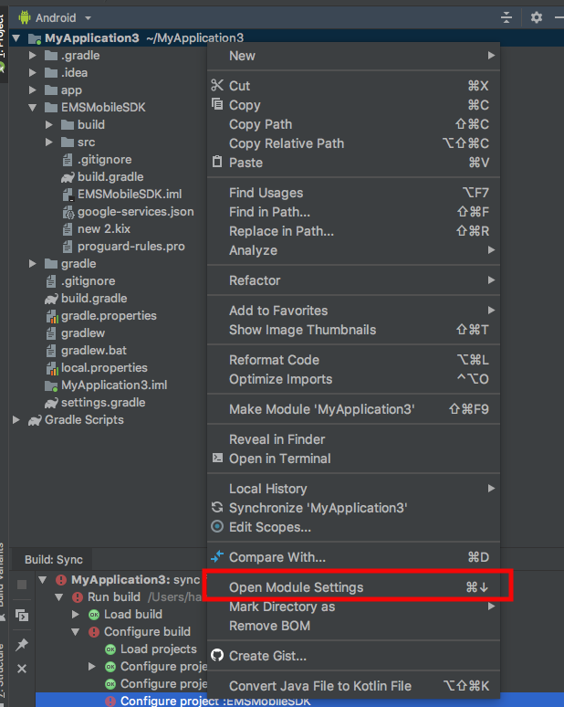
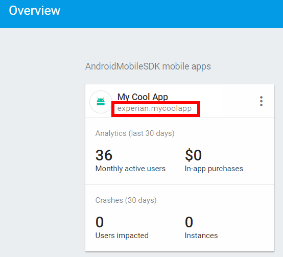

# Intended Audience

This document, source code, and resulting compiled library (SDK) is intended to be used in conjunction with Marketing Suite.  Use of the SDK is only supported after approval from Marketing Suite Client Developer Relations, and your account manager.

# Integrating CCMP with the Android Mobile SDK

CCMP enables marketers to target mobile devices running native applications for iOS and Android. The Android platform uses Firebase, the successor to Google Cloud Messaging (GCM). With push notifications, there are three parties in play: CCMP, Firebase, and the user's device with an app installed. The basic flow is as follows for Push Notifications.


1. After the app starts, the app contacts Firebase and requests a **device token**.
2. The **device token** is sent back to the device.
3. The **device token** is sent to CCMP along with an **App ID** and **Customer ID**.
4. CCMP registers the device token with the **App ID** and **Customer ID**, and sends back a **Push Registration ID** (PRID).
5. CCMP will then launch campaigns intending to target devices that have been registered with Push Notifications through Firebase.
6. Firebase pushes out the notifications to the devices.
7. After the user taps on the notification on the device, the app will notify CCMP that the app was opened from a Notification.

To make all this work, associations need to be set up between all three parties. This guide will walk you through these steps.


## Table of Contents

* Create or open a new project in Android Studio
* Create a Project on Firebase
* Register an App on Firebase
* Integrate the SDK with an App
* Adding the App to CCMP
* EMSMobileSDK Methods and Properties
* Sequence Diagram

## Create or open a new project in Android Studio

1. If you have an existing project you intend to use for Push Notification, open this project, Otherwise [create a new project in Android Studio](https://developer.android.com/studio/projects/create-project.html).

2. Once the project is opened, open the project App level Gradle Script. Copy the value next to **applicationID** in the script, which in the case below is "experian.mycoolapp".


This Application ID is needed to register a new app with Firebase.

1. Also, insure that the Google Repositories are installed. From the **Tools** menu, select **Android** -> **SDK Manager**. Select the **SDK Tools** tab, then expand **Support Repository**. Check **Google Repository** and click **OK**.


## Create a Project on Firebase

A Firebase project is a collection of apps that can use a variety of Google API's including push notifications. If you do not already have a Firebase project you intend to use with push notifications, you'll need to create one. Othewise, select the project and proceed to **Register an App on Firebase**.

1. Go to https://consoled.firebase.google.com and logon to Firebase with a Google account

2. Select **Create a New Project**.


3. Enter a new name in the **Project Name** field, then select **Create Project**.


​	
## Register an App on Firebase

4. On Firebase in the project you intend to use, select **Add Firebase to your Android app**.


5. On the dialog, paste the application ID from the app Gradle script into the **Package name** field, then optionally supply a **App nickname** for the app. Then click **Add App**. This will add the app and download a **GoogleServices.json** file to your computer. 


**Note:** On the next screen gives instructions on how to finish integrating Firebase into your app. These instructions will be amended with additional information below. Click **Continue**, then **Finish** on the last screen to add the app to the Firebase Project. 

6. In Android Studio, open the Project Gradle script labeled **build.gradle (Project: yourProject)** and add **classpath 'com.google.gms:google-services:4.0.1'** the to the project dependencies.

```json
dependencies {
		classpath 'com.android.tools.build:gradle:3.3.2'
		classpath 'com.google.gms:google-services:4.0.1'
...
```

7. Open the App Module Gradle script labeled **build.gradle (Module: app)** and add the following dependencies to the bottom of the app dependencies section.

```json
implementation 'com.google.firebase:firebase-messaging:11.8.0'
implementation 'com.google.firebase:firebase-core:11.8.0'
implementation 'com.android.volley:volley:1.1.0'
implementation 'org.apache.directory.studio:org.apache.commons.io:2.6'
```

8. Add **apply plugin: 'com.google.gms.google-services'** to the very bottom othe App Module Gradle file. The App Module Gradle script should look something like this at the end.

```json
dependencies {
    compile fileTree(include: ['*.jar'], dir: 'libs')
    androidTestCompile('com.android.support.test.espresso:espresso-core:2.2.2', {
        exclude group: 'com.android.support', module: 'support-annotations'
    })

    implementation 'com.android.support:appcompat-v7:26.1.0'
    testImplementation 'junit:junit:4.12'

    implementation 'com.cheetahdigital.android:EMSMobileSDK:$sdk_version:release@aar'

    implementation 'com.google.firebase:firebase-core:11.8.0'
    implementation 'com.google.firebase:firebase-messaging:11.8.0'
    implementation 'com.android.volley:volley:1.1.0'
}

apply plugin: 'com.google.gms.google-services'
```

9. On the root of the app module, copy and paste the **GoogleServices.json** file that was downloaded from Firebase.


10. Android Studio will display a banner asking you to resync the Gradle Scripts. Click **Sync Now**


## Integrate the SDK with an App

There are two import options available for integrating the Marketing Suite SDK into your app:

  1. AAR binaries through Maven Dependencies
  2. Download SDK through Github

### AAR Binaries through Maven Dependencies

1. Add this code on your top-level build.gradle file.

```json
allprojects {
    repositories {
        google()
        jcenter()
        mavenCentral()
        maven {
            url "https://s3.amazonaws.com/stellar-android"
              }
    }
}
```

1. On your app-level build.gradle, import the Marketing Suite Android SDK by adding the following:

```java
implementation 'com.cheetahdigital.android:EMSMobileSDK:1.6.1:release@aar'
```
1. Sync your project.  Click **Sync Now**


1. On the Main Activity for the App, add **import experian.mobilesdk.*;** to the imports at the top of the **MainActivity.java**.

1. Paste the following code into the **OnCreate** method.

```java
EMSMobileSDK.Default().init(
	 	getApplicationContext(),
	 	"APP ID GOES HERE",		//The Application ID	from CCMP
	 	100, 					//Customer ID
	 	Region.NORTH_AMERICA);	//The CCMP Region
```


You should have a MainActivity.java that looks similar to this:

```java
import experian.mobilesdk.*;

public class MainActivity extends AppCompatActivity implements IEMSPRIDCallback {

    @Override
    protected void onCreate(Bundle savedInstanceState) {
        super.onCreate(savedInstanceState);
        setContentView(R.layout.activity_main);

        //Initialize the SDK with the app context, the app's calling intent, the AppID from CCMP, the Custonmer ID, and the Region.
        EMSMobileSDK.Default().init(
                getApplicationContext(),
                "APP ID GOES HERE",
                100,
                Region.NORTH_AMERICA_SANDBOX);
```


### Download SDK through Github


1. Get the Marketing Suite Android SDK project from Github.

 	Link can be found here: [https://github.com/Marketing-Suite/android-sdk](https://github.com/Marketing-Suite/android-sdk).

 	You may clone/download the project by clicking the green button on the right hand side. Make sure to remember the location of the project file as this will be needed for the succeeding steps.
 	

1. Back in Android Studio with the project open, you can now add the SDK to the App. From the **File** menu, select **New** -> **New Module**.

1. From the **New Module** gallery, select **Import Gradle Project and** click **Next**.


1. On the next screen, click the **source directory** (...) icon.

1. Find the location  where **android-sdk** folder is saved, then click **Finish**.


1. Right-Click on the **Project Structure** located on the left side hand of the Android Studio and click **Open Module Settings**



1. On the **Modules -> app** tab, and click the **app** text, then select **Dependencies** Tab.


1. Click the **+** icon on the lower left corner and choose **Module Dependecy**, then Click **OK**.


1. Choose the **EMSMobileSDK** and click **OK**


1. On the Main Activity for the App, add **import experian.mobilesdk.*;** to the imports at the top of the **MainActivity.java**.

1. Paste the following code into the **OnCreate** method.

```java
EMSMobileSDK.Default().init(
	 	getApplicationContext(),
	 	"APP ID GOES HERE",		//The Application ID	from CCMP
	 	100, 					//Customer ID
	 	Region.NORTH_AMERICA);	//The CCMP Region
```


You should have a MainActivity.java that looks similar to this:

```java
import experian.mobilesdk.*;

public class MainActivity extends AppCompatActivity implements IEMSPRIDCallback {

    @Override
    protected void onCreate(Bundle savedInstanceState) {
        super.onCreate(savedInstanceState);
        setContentView(R.layout.activity_main);

        //Initialize the SDK with the app context, the app's calling intent, the AppID from CCMP, the Custonmer ID, and the Region.
        EMSMobileSDK.Default().init(
                getApplicationContext(),
                "APP ID GOES HERE",
                100,
                Region.NORTH_AMERICA_SANDBOX);
```

## Adding the App to CCMP

In order to add an app to CCMP, you'll need to have the package name on Google.


1. On CCMP, select the **Globe** icon, then select **Mobile Push Application Groups**.


1. Either select an existing group or create a new group.

  * Create a new group by selecting the **+** icon, typing in a name for the group on the dialog, then click **Save New Item**.


	* Either select the newly created group or the existing group in the list of Application Groups.


1. On the [Firebase Console](http://firebase.google.com), select the **Project** that you are registering from the dashboard.


1. On the Project dashboard, copy the name of the application you want to integrate with CCMP.


1. Copy the name of the application you want to use with CCMP.



1. Back on CCMP, Click, **Add Application**.


1. Select **Android GCM** next to **Platform** and paste the application name in the **Application Name** field.

2. Back on Firebase, select the context menu for the application, then select **Settings**.


1. Select the **Cloud Messaging** tab, then copy the **Server Key**.


1. On CCMP, paste the **Server Key **into the **Google API Key**, then click **Save**.


1. Copy the Application ID generated by the application.


1. Paste the key into the init method for the SDK.

   ```java
   import experian.mobilesdk.*;

   public class MainActivity extends AppCompatActivity implements IEMSPRIDCallback {

       @Override
       protected void onCreate(Bundle savedInstanceState) {
           super.onCreate(savedInstanceState);
           setContentView(R.layout.activity_main);

           //Initialize the SDK with the app context, the app's calling intent, the AppID from CCMP, the Custonmer ID, and the Region.
           EMSMobileSDK.Default().init(
                   getApplicationContext(),
                   "df0cde1c-81a7-48d4-b65d-3b1f83e4c746",
                   100,
                   Region.NORTH_AMERICA_SANDBOX);
   ```

## Using Deep Link

The SDK offers a method to handle deep links from Marketing Suite, the call to EMSMobileSDK.Default().HandleDeepLink will parse the incoming deep link URL and returns the original URL along with the Deep Link Parameter entered on CCMP (if any)

> Note:  You first need to configure the app to handle universal links, add in the manifest.xml the following intent-filter. The values in the intent-filter here are used as an example, in this case "rts.eccmp.com" which will handle links of the type "http://rts.eccmp.com"
```xml
<intent-filter>
	<action android:name="android.intent.action.VIEW" />
	<category android:name="android.intent.category.DEFAULT" />
	<category android:name="android.intent.category.BROWSABLE" />
	<data android:scheme="http"
		android:host="rts.eccmp.com"/>
</intent-filter>
```

```java
protected void onCreate(Bundle savedInstanceState) {
...
Intent intent = getIntent();

if(intent.getAction() == "android.intent.action.VIEW"){
            EMSDeepLink deepLink = EMSMobileSDK.Default().HandleDeepLink(intent);

			//deeplink.getDeepLinkParameter() - dl parameter from CCMP if any; example value: "param"
			//deeplink.getDeepLinkUrl()		  - Original Deep link URL; example value: "http://rts.eccmp.com/rts/go2.aspx?dl=param"
	}
}
```


## EMSMobileSDK Methods and Properties

### Properties

**AppID** -- The App ID from CCMP when an application is registered.

**PRID** -- The Push Registration ID received from CCMP after the SDK is initialized.

**Customer ID** -- The Customer ID that gets associated with the PRID. This is supplied by the developer.

**Region** -- The Region for CCMP.

**Token** -- The Device Token sent to the device from Firebase. CCMP uses the device token to uniquely identify the device so that Push Notifications can be sent to the device.

### Methods
---

#### **init**(Context **ctx**, Intent **appIntent**, String **AppID**, int **CustomerID**)

The `init` method initializes the SDK from the application so that Push Notifications can be received from CCMP. The overloaded method below allows for the region to be specified. If no region is specified, the SDK defaults to North America.

* **ctx** -- The Application Context for the app using the SDK.
* **appIntent** -- The Application Intent that was used to start the app using the SDK.
* **AppID** -- The Application ID from CCMP.
* **CustomerID** -- The Customer ID that uniquely identifies the user of the applicaiton.


---

#### **init**(Context **ctx**, Intent **appIntent**, String **AppID**, int **CustomerID**, Region **region**)

The `init` method initializes the SDK from the application so that Push Notifications can be received from CCMP.

* **ctx** -- The Application Context for the app using the SDK.
* **appIntent** -- The Application Intent that was used to start the app using the SDK.
* **AppID** -- The Application ID from CCMP.
* **CustomerID** -- The Customer ID that uniquely identifies the user of the applicaiton.
* **region** -- the CCMP region that the application uses.

---

#### **registerPRIDCallback**(IEMSPRIDCallback **pridCallback**)

The `RegisterPRIDCallback` method registers a callback in the application which is executed when the PRID has been successfully retrieved from CCMP.

* **pridCallback** -- a class that implements the SDK's IEMSPRIDCallback interface. The callback expects a method called onPRIDReceived(String prid) that receives a string containing the PRID returned by CCMP for this application/device instance.

---

#### **apiPost**(int **formId**, Map<String, String> **data**, IEMSAPIPostCallback **callback**)

The `apiPost` method is used to post data from the app to a form hosted in CCMP.

- **formId** -- the form ID from CCMP for the form you want to post data to
- **data** -- A key/value structure of the fields and values you want to post to the form
- **callback** -- A class that implements the IEMSPostCallback::onDataSent(VolleyError error) method.  This method is called when the API Post is complete.  If the error parameter passed to the method is null, the API Post was successful, otherwise the error will have the data about what exactly went wrong.

---

#### **HandleDeepLink**(Intent **intent**)

The `HandleDeepLink` function parses the information from the userActivity and returns the original Deep link URL, the Deep link Paramater if any, and finally register the link count on CCMP.

- **intent** -- the intent-filter we set up in our manifest to pass the deep link url values

---

#### **NotificationOptInStatusCheck()**

The `NotficationOptInStatusCheck()` method is used to confirm Marketing Suite opt-in status for GCM/Firebase notifications to the application.

A call to this method should be placed in the `OnResume()` method of the _MainActivity_ class. This will ensure its being called in the case that the user has either turned on or turned off notifications for the application via the Android settings.  This will mark the PRID with a status indicating opted-in or opted-out, depending on the setting.  Messages from Marketing Suite will only be sent to the device when it is opted-in via the Android settings.

------

## Overriding Default Push Behavior

The EMS Mobile SDK is designed to be able to manage inbound push notifications on behalf of the app with minimal intervention.  If however the application developer wants to modify the default behavior, the following options are available.

### Default Push Behavior

By default, the EMS Mobile SDK will manage the showing of notifications and registering the opens from the push notification by simply adding the following to your Android manifest file.

```xml
<receiver android:name="experian.mobilesdk.NotificationReceiver" android:enabled="true">
    <intent-filter>
        <action android:name="${packageName}.EMS_SHOW_NOTIFICATION" />
        <action android:name="${packageName}.EMS_OPEN_NOTIFICATION" />
        <category android:name="android.intent.category.DEFAULT" />
    </intent-filter>
</receiver>
```

### Override Refreshed Token from Google Firebase

The EMS Mobile SDK responds to any changes in the Firebase DeviceToken by registering an instance of FirebaseInstanceIdService in the Android Manifest.  The application developer can override this functionality by adding the following to their Android.manifest file.

#### Manifest

```xml
<service
    android:name=".IDService">
    <intent-filter>
        <action android:name="com.google.firebase.INSTANCE_ID_EVENT"/>
    </intent-filter>
</service>
```

#### Service

The following is the default implementation to handle DeviceToken changes in the EMS Mobile SDK.

```java
package experian.mobilesdk;

import android.util.Log;
import com.google.firebase.iid.FirebaseInstanceId;
import com.google.firebase.iid.FirebaseInstanceIdService;

/**
 * This is the Firebase ID Services that gets called when a Device Token changes.
 */

public class IDService extends FirebaseInstanceIdService {

    private static final String TAG = "IDService";

    @Override
    public void onTokenRefresh() {
        FirebaseInstanceIdService fid = new FirebaseInstanceIdService();
        String refreshedToken = FirebaseInstanceId.getInstance().getToken();
        Log.d(TAG, "Refreshed token: " + refreshedToken);
        try {
            EMSMobileSDK.Default().initFromContext(getApplicationContext());
        }
        catch (Exception e)
        {
            Log.e(TAG,"Error initializing EMSMobileSDK solely from application context. The SDK must first be initialized with customer mobile application settings");
        }
        EMSMobileSDK.Default().setToken(getApplicationContext(), refreshedToken);
    }
}
```

> NOTE:  If you choose to override this default functionality, be sure to call both the `EMSMobileSDK.Default().initFromContext()`, and `EMSMobileSDK.Default().setToken()` methods passing in the application context and token received from Firebase respectively, or future notifications will not be received from CCMP.

------

### Push Notification Received

The EMS Mobile SDK handles data push notifications by registering an instance of FirebaseMessagingService  in the Android manifest.  If the app developer only wants to be informed of incoming push notifications without changing the default behavior from the SDK, they need only implement a BroadcastReceiver listening for the "${packageName}.EMS_PUSH_RECEIVED" intent.*

#### Manifest

```xml
<receiver android:name=".MyPushReceiverClass" android:enabled="true">
    <intent-filter>
        <action android:name="${packageName}.EMS_PUSH_RECEIVED" />
        <category android:name="android.intent.category.DEFAULT" />
    </intent-filter>
</receiver>
```

#### Receiver

```java
public class MyPushReceiverClass extends BroadcastReceiver {

    /**
     * Received broadcast notifications
     * @param context
     * @param intent
     */
    @Override
    public void onReceive(Context context, Intent intent) {
        if (intent.getAction().equals(EMSIntents.EMS_PUSH_RECEIVED)) {
          // Your Code Here
        }
    }
}
```

------

### Override Default Notification Icon

The EMS Mobile SDK uses the icon defined in the ""\res\drawable\notification_icon.png" of the app.  There is a basic icon embedded into the EMS Mobile SDK but the app developer should override this by adding a resource with the same name "notification_icon.png" to their application in the drawable directory.

------

### Override Default Notification Display

The EMS Mobile SDK displays basic notification information received from Firebase as part of the default behavior of the FirebaseMessingService instance registered in the Android.manifest file.  The app developer can override the notification display process by implementing a listener for the "${packageName}.EMS_SHOW_NOTIFICATION" intent in the Android.manifest file.

#### Manifest

```xml
<receiver android:name="ShowNotificationReceiver" android:enabled="true">
    <intent-filter>
        <action android:name="${packageName}.EMS_SHOW_NOTIFICATION" />
        <category android:name="android.intent.category.DEFAULT" />
    </intent-filter>
</receiver>
```

### Override Notification Channel Name
The EMS Mobile SDK uses **default_notification_channel_name** to create the notification channel name. By default, notification channel name is **EMS Channel**.  The app developer can override this by overriding  **default_notification_channel_name**  in **strings.xml**

#### Receiver

The following is the default behavior defined by the SDK in the NotificationReceiver.

```java
public class ShowNotificationReceiver extends BroadcastReceiver {

    //ID's used by the  notification PI in Android
    static final int NOTIFICATION_ID = 109011;
    static final String NOTIFICATION_TAG = "EMSNotification";
    static final String TAG = "EMS:NotificationReceive";

    /**
     * Received broadcast notifications
      * @param context
     * @param intent
     */
    @Override
    public void onReceive(Context context, Intent intent) {
        if (intent.getAction().equals(EMSIntents.EMS_SHOW_NOTIFICATION)) {
            Object data = intent.getExtras().get("data");
            if (data != null) {
                RemoteMessage message = (RemoteMessage) data;
                JSONObject jData = new JSONObject(message.getData());
                displayNotification(context, jData);
            }
        }
    }

    //This method is called whenever a Push Notification comes in.
    void displayNotification(Context ctx, JSONObject data){
        NotificationCompat.Builder mBuilder = new NotificationCompat.Builder(ctx);

        // set default icon
        mBuilder.setSmallIcon(R.drawable.notification_icon);

        //Attempts to extract the tile from the Push Notification.
        if (data.has("title")){
            try {
                mBuilder.setContentTitle(data.getString("title"));
            } catch (JSONException e) {
                mBuilder.setContentTitle("");
            }
        }

        //Attempts to extract the tile from the Push Notification.
        if (data.has("body")) try {
            mBuilder.setContentText(data.getString("body"));
        } catch (JSONException e) {
            mBuilder.setContentText("");
        }

        Intent resultIntent =  new Intent(EMSIntents.EMS_OPEN_NOTIFICATION);
        try {
            resultIntent.putExtra("ems_open",data.getString("ems_open"));
        } catch (JSONException e) {
            e.printStackTrace();
        }
        PendingIntent resultPendingIntent = PendingIntent.getBroadcast(ctx, 0, resultIntent, PendingIntent.FLAG_UPDATE_CURRENT);

        mBuilder.setContentIntent(resultPendingIntent);
        mBuilder.setAutoCancel(true);
        NotificationManager mNotifyMgr =  (NotificationManager) ctx.getSystemService(NOTIFICATION_SERVICE);
        mNotifyMgr.notify(NOTIFICATION_TAG, NOTIFICATION_ID, mBuilder.build());
    }
```

------

### Overriding Push Notification Open

The EMS Mobile SDK handles the response to a user opening the application based on touching a displayed push notification by registering a BroadcastReceiver in the AndroidManifest listening for the "${packageName}.EMS_OPEN_NOTIFICATION"  intent.  The app developer can override the default behavior by adding the following to the Android.manifest file.

#### Manifest

```xml
<receiver android:name="OpenNotificationReceiver" android:enabled="true">
    <intent-filter>
        <action android:name="${packageName}.EMS_OPEN_NOTIFICATION" />
        <category android:name="android.intent.category.DEFAULT" />
    </intent-filter>
</receiver>
```

#### Receiver

The following is the default Receiver implementation used by the SDK for the "${packageName}.EMS_OPEN_NOTIFICATION" intent.  Note that it will add the boolean value to the Intent's Extras dictionary for use by your application's onCreate method if needed.

```java
public class OpenNotificationReceiver extends BroadcastReceiver {

    /**
     * Received broadcast notifications
      * @param context
     * @param intent
     */
    @Override
    public void onReceive(Context context, Intent intent) {
        if (intent.getAction().equals(EMSIntents.EMS_OPEN_NOTIFICATION)) {
            EMSMobileSDK.Default().pushNotificationRegisterOpen(context, intent);
            // launch app
            try {
                Intent launchIntent = context.getPackageManager().getLaunchIntentForPackage(context.getPackageName());
                if (launchIntent == null)
                    Log.d(TAG, "Unable to find launch intent");
                launchIntent.putExtra("EMS_OPEN_FROM_NOTIFICATION", true);
                context.startActivity(launchIntent);
                Log.d(TAG,"Leaving Receiver: " + launchIntent.getClass().toString());
            }
            catch (Exception ex)
            {
                Log.d(TAG, ex.getMessage());
            }
        }
    }
```

*NOTE:  If the app developer overrides the default EMS_OPEN_NOTIFICATION intent, you must call **EMSMobileSDK.Default().pushNotificationRegisterOpen()** method to ensure that the app open gets recorded in CCMP.*

### Sequence Diagram


